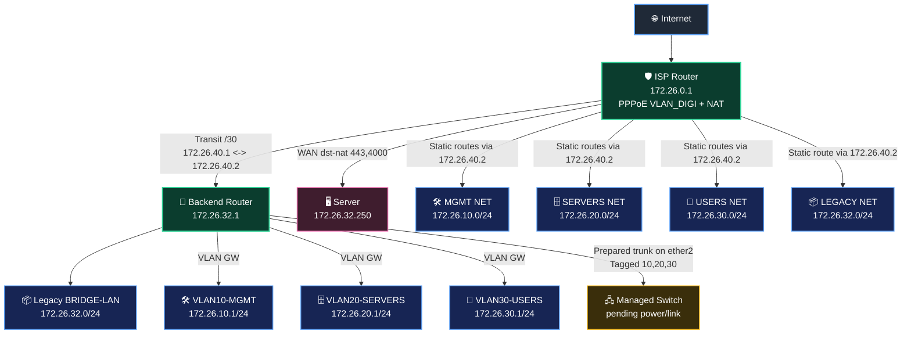
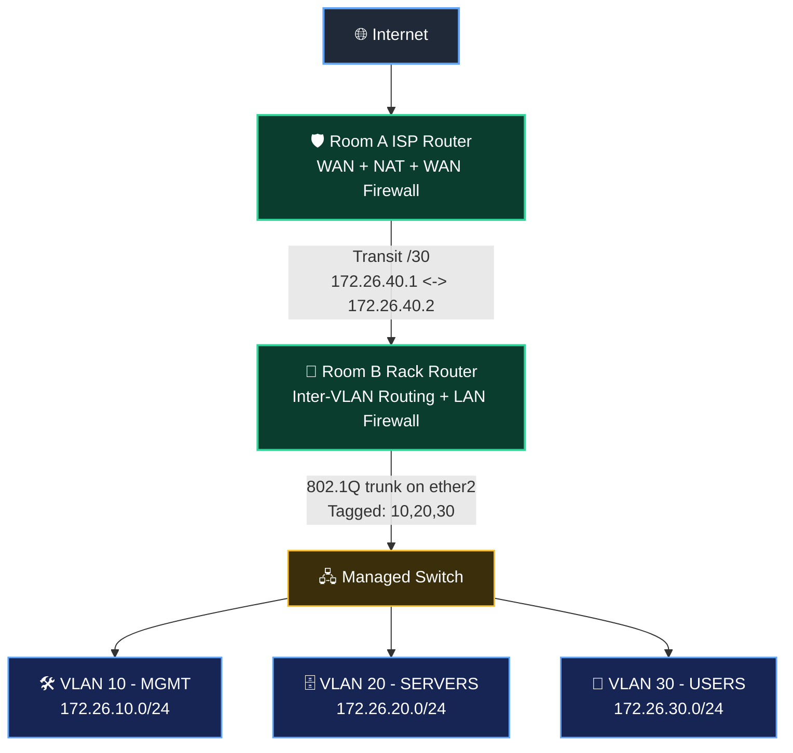

# Network Evolution Project

This repository documents and automates the evolution of a home/lab network toward a more professional, maintainable setup.

## Main Purpose

Build the network step by step into a cleaner and more professional architecture, while keeping operations simple and safe.

Current high-level approach:
- **Room A router (ISP edge)** handles WAN, NAT, and Internet-facing firewalling.
- **Room B router (rack side)** handles internal routing/firewalling for rack networks.
- **Managed switch in the rack** provides VLAN-based segmentation for servers and other devices.

## Current Migration Status

Completed:
- [x] Removed backend double-NAT (`srcnat masquerade` on backend disabled).
- [x] Moved WAN publishing to ISP router directly to final server (`172.26.32.250` ports `443` and `4000`).
- [x] Disabled legacy chained NAT path to backend transit IP (`172.26.40.2`) on ISP.
- [x] Disabled legacy backend `dstnat` publish rules from `UPLINK-A`.
- [x] Added/cleaned static routes on ISP to Room B networks via `172.26.40.2`:
  - `172.26.10.0/24`
  - `172.26.20.0/24`
  - `172.26.30.0/24`
  - `172.26.32.0/24`
- [x] Created backend VLAN L3 gateways and DHCP scopes:
  - VLAN10 MGMT (`172.26.10.1/24`)
  - VLAN20 SERVERS (`172.26.20.1/24`)
  - VLAN30 USERS (`172.26.30.1/24`)
- [x] Fixed overlapping subnet issue on ISP router (changed from `/19` to `/24`).
- [x] Added firewall rules on backend router to allow ISP network traffic to VLANs.

Pending:
- [ ] Managed switch bring-up and trunk activation on backend `ether2`.
- [ ] Access port assignment per VLAN on managed switch.
- [ ] Inter-VLAN firewall policy (default deny + explicit allow rules).
- [ ] Gradual server/client migration from legacy subnet to VLANs.

## Live Topology Snapshot (Latest Router Exports)



Notes from latest exports:
- Backend `srcnat masquerade` is disabled (no double NAT).
- Backend legacy `dstnat` rules are disabled.
- ISP old forwarding to `172.26.40.2` is disabled; direct forwarding to `172.26.32.250` is active.

## Target Network Design (After Switch/VLAN Cutover)



## Repository Structure

- `.github/instructions/mikrotik-backup.instructions.md`
  Workspace instructions for router backup automation context.
- `scripts/backup_mikrotik_configs.py`
  Pulls config exports from routers and produces sanitized versions.
- `config/raw/`
  Raw exports (sensitive, not tracked by git).
- `config/sanitized/`
  Sanitized exports intended for version control review.
- `.env`
  Local credentials file (ignored by git).

## Configuration Backup History

### 2026-07-20 21:12:12 UTC
**File:** `isp-20260720-211212.sanitized.rsc` / `backend-20260720-211212.sanitized.rsc`

**Changes Applied:**
1. **ISP Router Subnet Fix**: Changed ISP network from `/19` to `/24`
   - Previous: `172.26.0.1/19` (covered 172.26.0.0 – 172.26.31.255)
   - Current: `172.26.0.1/24` (covers only 172.26.0.0 – 172.26.0.255)
   - **Reason:** Overlapping netmask was preventing clients from routing to VLAN networks via gateway
   - **Impact:** Clients now correctly identify VLAN20, VLAN30, etc. as non-local and route through gateway

2. **Backend Router Firewall Rules Added**: Allow ISP network traffic to VLANs 20 & 30
   - Rule: `Allow from ISP to VLAN20 via uplink` (dst-address 172.26.20.0/24, in-interface UPLINK-A)
   - Rule: `Allow ISP network to VLAN20` (src 172.26.0.0/16 → dst 172.26.20.0/24)
   - Rule: `Allow from ISP to VLAN30 via uplink` (dst-address 172.26.30.0/24, in-interface UPLINK-A)
   - Rule: `Allow ISP network to VLAN30` (src 172.26.0.0/16 → dst 172.26.30.0/24)
   - **Reason:** Enable SSH and other services from ISP network to VLAN20/30 devices
   - **Impact:** Connectivity from ISP clients to VLAN20 devices (e.g., 172.26.20.254) now works

**Testing Verified:**
- ✅ `ping 172.26.20.254` from ISP client succeeds
- ✅ `ssh admin@172.26.20.254` from ISP client succeeds
- ✅ Backend router can ping VLAN20 devices directly

---

## Automated Router Backup & Sanitization

The script connects to:
- `isp`: `172.26.0.1`
- `backend`: `172.26.32.1`
- user: `admin`

Passwords are loaded from `.env`.

### 1) Configure `.env`

Create/update:

```env
ROUTER_ISP_PASSWORD=your_password_here
ROUTER_BACKEND_PASSWORD=your_password_here
```

Optional host overrides:

```env
ROUTER_ISP_HOST=172.26.0.1
ROUTER_BACKEND_HOST=172.26.32.1
```

### 2) Run backup

```bash
./scripts/backup_mikrotik_configs.py
```

Output:
- raw: `config/raw/<router>-<timestamp>.rsc`
- sanitized: `config/sanitized/<router>-<timestamp>.sanitized.rsc`

## Security Rules

- Never commit `config/raw/`.
- Never commit real credentials.
- Review sanitized files before commit.
- If a secret is ever exposed, rotate it immediately.

## Troubleshooting Guide

### DHCP Not Working with Multiple Bonding Cables

#### Symptom
When bonding multiple cables between a MikroTik router and a managed switch:
- ✅ Static IPs work fine
- ✅ Ping works fine
- ❌ DHCP Discover fails (no lease obtained)
- ✅ Single cable works perfectly

#### Root Cause
This issue typically occurs when there is a **mismatch between link aggregation modes** on the two devices:

| Device       | Configuration                    | Negotiation                              |
|--------------|----------------------------------|------------------------------------------|
| **MikroTik** | `mode=802.3ad` (LACP)            | Expects dynamic negotiation with partner |
| **Switch** LG-SWG24-WEB  | Static Port Trunk / Port Bonding | **No LACP handshake**                    |

Many inexpensive switches (e.g., Realtek-based) have **two separate features**:
1. **Static Trunk / Port Trunk** – Groups ports without protocol negotiation
2. **LACP / 802.3ad** – Dynamic link aggregation (separate menu/page on most switches)

When the switch uses static trunking while MikroTik expects LACP, broadcasts (like DHCP Discover) are often the first to fail because the trunk isn't agreed upon properly between both ends.

#### Solution

**Step 1:** Verify your switch configuration.
Check if your switch has a separate **LACP**, **Link Aggregation**, or **802.3ad** menu page.
- **If it does:** Enable LACP on the switch trunk and keep MikroTik's `mode=802.3ad`.
- **If it doesn't:** Proceed to Step 2.

**Step 2:** Change MikroTik bonding mode from LACP to static aggregation.

Update your bonding interface to use `balance-xor` mode (designed for static trunks):

```
/interface bonding
set LAG-SWITCH-V2 mode=balance-xor transmit-hash-policy=layer-2-and-3
```

Or in separate commands:
```
/interface bonding
set LAG-SWITCH-V2 mode=balance-xor
set LAG-SWITCH-V2 transmit-hash-policy=layer-2-and-3
```

**Explanation of parameters:**
- `mode=balance-xor` – Distributes traffic using XOR of MAC addresses; works with static trunks
- `transmit-hash-policy=layer-2-and-3` – Better distribution than `layer-2` alone; uses MAC + IP to select outgoing port

**Step 3 (Optional):** Verify bonding status.
Run:
```
/interface bonding monitor LAG-SWITCH-V2 once
```

- **With LACP:** You'll see `actor-key`, `partner-key`, and detailed state information
- **Without LACP:** You'll only see `active-port` and `inactive-port` — confirming static mode

#### Why DHCP Fails First

DHCP is **broadcast traffic**:
```
Source: 0.0.0.0
Destination: 255.255.255.255
Flags: BROADCAST
```

When a trunk isn't properly negotiated:
- **Unicast traffic** (ping, SSH) may work because it flows through one cable at a time
- **Broadcast traffic** (DHCP Discover, ARP broadcasts) fails because:
  - The trunk may not properly flood frames across all bundled ports
  - Frames may be duplicated or dropped inconsistently
  - The switch and MikroTik disagree on trunk membership

Removing the bond and using a single cable bypasses the trunk entirely, which is why single-cable configurations work.

---

## Professionalization Roadmap (Practical)

1. Keep **single NAT boundary** at ISP edge router.
2. Use **clear VLAN segmentation** (management, servers, users, optional guest/iot).
3. Enforce **least-privilege firewall rules** between VLANs.
4. Centralize and version-control **sanitized config snapshots**.
5. Add monitoring/observability (latency, packet loss, service reachability).
6. Document each change with before/after notes.

## Notes

This repo is meant to evolve with the network. Keep changes incremental, tested, and easy to roll back.

## Session Resume Checklist

Use this checklist at the beginning of the next session:

1. Pull latest backups:
   ```bash
   ./scripts/backup_mikrotik_configs.py
   ```
2. Read, in order:
   - this `README.md`
   - latest `config/sanitized/isp-*.sanitized.rsc`
   - latest `config/sanitized/backend-*.sanitized.rsc`
3. Confirm current state:
   - ISP direct publish to `172.26.32.250` (`443`, `4000`)
   - backend `srcnat` disabled
   - backend legacy `dstnat` disabled
   - ISP static routes to `172.26.10/20/30/32` via `172.26.40.2`
4. Continue from `Pending` checklist under **Current Migration Status**.

Starter prompt for next time:

```text
Continue Network project.
Read README.md and latest config/sanitized/*.sanitized.rsc first.
Then continue from the Pending checklist.
```

## Diagram Format

This project standard is **Mermaid** diagrams in Markdown.

- Keep the network topology diagram directly in `README.md` using Mermaid code blocks.
- Update the Mermaid diagram whenever topology, VLANs, or routing changes.
- Prefer Mermaid over image-based diagrams to keep reviews and diffs simple.
